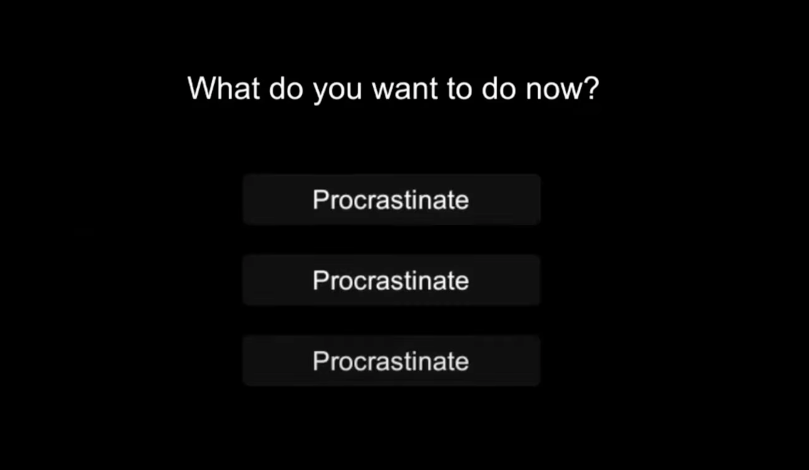

# A Composer's Life

Author: Wish Kuo

Design:  
It is not working :(  
Just run out of the time due to falling off from a scooter last Friday and hardly be able to type until today.  
My recent thought was to rebuild a game according to a short experience made for the other class last year.  
The Demo Video: https://www.youtube.com/watch?v=4Hq0_6s_Czk&ab_channel=VisualStory

Text Drawing: (TODO: how does the text drawing in this game work? Is text precomputed? Rendered at runtime? What files or utilities are involved?)

Screen Shot:

How To Play:  
Recent thought: 
Use Up/Down arrow to switch the choice and the final composed music will be different regarding to your choices.

Sources:  
font: https://fonts.google.com/specimen/Handlee?query=hand#standard-styles  
Learning materials:
https://www.freetype.org/freetype2/docs/tutorial/step1.html
https://learnopengl.com/In-Practice/Text-Rendering

This game was built with [NEST](NEST.md).

